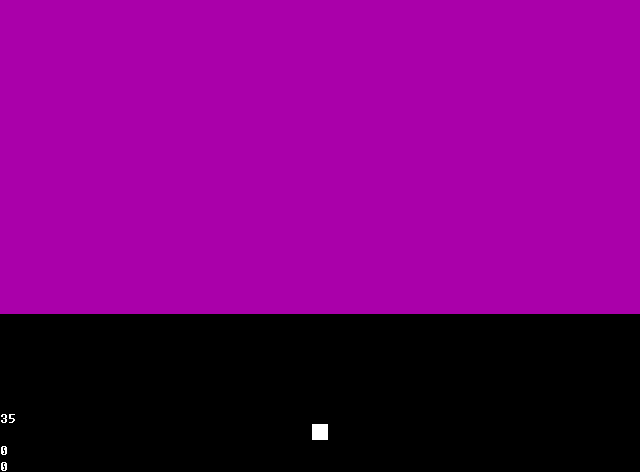

# BlockBreakC
A port of BlockBreakHC from HolyC to C using SDL3

# Screenshots

# Controls

| Key            | Action     |
| -------------- | ---------- |
| Up             | Move Up    |
| Down           | Move Down  |
| Left           | Move Left  |
| Right          | Move Right |
| Enter          | Restart    |
| Escape         | Quit       |